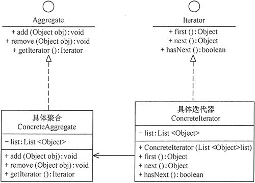

在现实生活以及程序设计中，经常要访问一个聚合对象中的各个元素，如“数据结构”中的链表遍历，通常的做法是将链表的创建和遍历都放在同一个类中，但这种方式不利于程序的扩展，如果要更换遍历方法就必须修改程序源代码，这违背了 “开闭原则”。

既然将遍历方法封装在聚合类中不可取，那么聚合类中不提供遍历方法，将遍历方法由用户自己实现是否可行呢？答案是同样不可取，因为这种方式会存在两个缺点：
1. 暴露了聚合类的内部表示，使其数据不安全；
2. 增加了客户的负担。

“迭代器模式”能较好地克服以上缺点，它在客户访问类与聚合类之间插入一个迭代器，这分离了聚合对象与其遍历行为，对客户也隐藏了其内部细节，且满足“单一职责原则”和“开闭原则”，如 Java 中的 Collection、List、Set、Map 等都包含了迭代器。

迭代器模式在生活中应用的比较广泛，比如：物流系统中的传送带，不管传送的是什么物品，都会被打包成一个个箱子，并且有一个统一的二维码。这样我们不需要关心箱子里是什么，在分发时只需要一个个检查发送的目的地即可。再比如，我们平时乘坐交通工具，都是统一刷卡或者刷脸进站，而不需要关心是男性还是女性、是残疾人还是正常人等信息。

## 模式的定义与特点

迭代器（Iterator）模式的定义：提供一个对象来顺序访问聚合对象中的一系列数据，而不暴露聚合对象的内部表示。迭代器模式是一种对象行为型模式，其主要优点如下。
1. 访问一个聚合对象的内容而无须暴露它的内部表示。
2. 遍历任务交由迭代器完成，这简化了聚合类。
3. 它支持以不同方式遍历一个聚合，甚至可以自定义迭代器的子类以支持新的遍历。
4. 增加新的聚合类和迭代器类都很方便，无须修改原有代码。
5. 封装性良好，为遍历不同的聚合结构提供一个统一的接口。

其主要缺点是：增加了类的个数，这在一定程度上增加了系统的复杂性。

在日常开发中，我们几乎不会自己写迭代器。除非需要定制一个自己实现的数据结构对应的迭代器，否则，开源框架提供的 API 完全够用。

## 模式的结构与实现

迭代器模式是通过将聚合对象的遍历行为分离出来，抽象成迭代器类来实现的，其目的是在不暴露聚合对象的内部结构的情况下，让外部代码透明地访问聚合的内部数据。现在我们来分析其基本结构与实现方法。

### 模式的结构
迭代器模式主要包含以下角色。
1. 抽象聚合（Aggregate）角色：定义存储、添加、删除聚合对象以及创建迭代器对象的接口。
2. 具体聚合（ConcreteAggregate）角色：实现抽象聚合类，返回一个具体迭代器的实例。
3. 抽象迭代器（Iterator）角色：定义访问和遍历聚合元素的接口，通常包含 hasNext()、first()、next() 等方法。
4. 具体迭代器（Concretelterator）角色：实现抽象迭代器接口中所定义的方法，完成对聚合对象的遍历，记录遍历的当前位置。



### 模式的实现

```java
public class IteratorPattern {
    public static void main(String[] args) {
        Aggregate ag = new ConcreteAggregate();
        ag.add("中山大学");
        ag.add("华南理工");
        ag.add("韶关学院");
        System.out.print("聚合的内容有：");
        Iterator it = ag.getIterator();
        while (it.hasNext()) {
            Object ob = it.next();
            System.out.print(ob.toString() + "\t");
        }
        Object ob = it.first();
        System.out.println("\nFirst：" + ob.toString());
    }
}
//抽象聚合
interface Aggregate {
    public void add(Object obj);
    public void remove(Object obj);
    public Iterator getIterator();
}
//具体聚合
class ConcreteAggregate implements Aggregate {
    private List<Object> list = new ArrayList<Object>();
    public void add(Object obj) {
        list.add(obj);
    }
    public void remove(Object obj) {
        list.remove(obj);
    }
    public Iterator getIterator() {
        return (new ConcreteIterator(list));
    }
}
//抽象迭代器
interface Iterator {
    Object first();
    Object next();
    boolean hasNext();
}
//具体迭代器
class ConcreteIterator implements Iterator {
    private List<Object> list = null;
    private int index = -1;
    public ConcreteIterator(List<Object> list) {
        this.list = list;
    }
    public boolean hasNext() {
        if (index < list.size() - 1) {
            return true;
        } else {
            return false;
        }
    }
    public Object first() {
        index = 0;
        Object obj = list.get(index);
        ;
        return obj;
    }
    public Object next() {
        Object obj = null;
        if (this.hasNext()) {
            obj = list.get(++index);
        }
        return obj;
    }
}
```

## 模式的应用实例

例：用迭代器模式编写一个浏览婺源旅游风景图的程序。

分析：婺源的名胜古迹较多，要设计一个查看相关景点图片和简介的程序，用“迭代器模式”设计比较合适。

首先，设计一个婺源景点（WyViewSpot）类来保存每张图片的名称与简介；再设计一个景点集（ViewSpotSet）接口，它是抽象聚合类，提供了增加和删除婺源景点的方法，以及获取迭代器的方法。

然后，定义一个婺源景点集（WyViewSpotSet）类，它是具体聚合类，用 ArrayList 来保存所有景点信息，并实现父类中的抽象方法；再定义婺源景点的抽象迭代器（ViewSpotltemtor）接口，其中包含了查看景点信息的相关方法。

最后，定义婺源景点的具体迭代器（WyViewSpotlterator）类，它实现了父类的抽象方法；客户端程序设计成窗口程序，它初始化婺源景点集（ViewSpotSet）中的数据，并实现 ActionListener 接口，它通过婺源景点迭代器（ViewSpotlterator）来査看婺源景点（WyViewSpot）的信息。


该例子在 _PictureIterator.java_ 中实现

## 模式的应用场景

迭代器模式通常在以下几种情况使用。
1. 当需要为聚合对象提供多种遍历方式时。
2. 当需要为遍历不同的聚合结构提供一个统一的接口时。
3. 当访问一个聚合对象的内容而无须暴露其内部细节的表示时。

## 模式的扩展

迭代器模式常常与组合模式结合起来使用，在对组合模式中的容器构件进行访问时，经常将迭代器潜藏在组合模式的容器构成类中。当然，也可以构造一个外部迭代器来对容器构件进行访问

