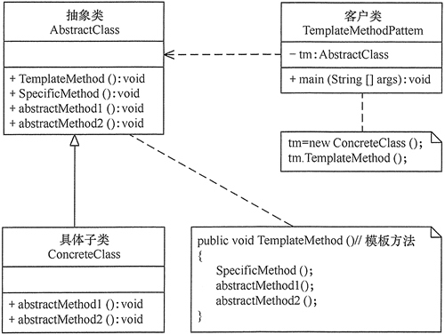
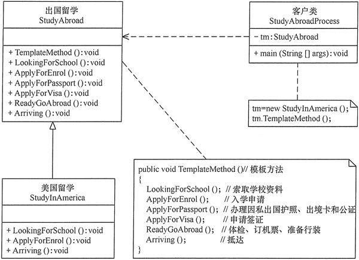

在面向对象程序设计过程中，程序员常常会遇到这种情况：设计一个系统时知道了算法所需的关键步骤，而且确定了这些步骤的执行顺序，但某些步骤的具体实现还未知，或者说某些步骤的实现与具体的环境相关。

例如，去银行办理业务一般要经过以下4个流程：取号、排队、办理具体业务、对银行工作人员进行评分等，其中取号、排队和对银行工作人员进行评分的业务对每个客户是一样的，可以在父类中实现，但是办理具体业务却因人而异，它可能是存款、取款或者转账等，可以延迟到子类中实现。

## 模式的定义与特点

模板方法（Template Method）模式的定义如下：定义一个操作中的算法骨架，而将算法的一些步骤延迟到子类中，使得子类可以不改变该算法结构的情况下重定义该算法的某些特定步骤。它是一种类行为型模式。

该模式的主要优点如下。
1. 它封装了不变部分，扩展可变部分。它把认为是不变部分的算法封装到父类中实现，而把可变部分算法由子类继承实现，便于子类继续扩展。
2. 它在父类中提取了公共的部分代码，便于代码复用。
3. 部分方法是由子类实现的，因此子类可以通过扩展方式增加相应的功能，符合开闭原则。

该模式的主要缺点如下。
1. 对每个不同的实现都需要定义一个子类，这会导致类的个数增加，系统更加庞大，设计也更加抽象，间接地增加了系统实现的复杂度。
2. 父类中的抽象方法由子类实现，子类执行的结果会影响父类的结果，这导致一种反向的控制结构，它提高了代码阅读的难度。
3. 由于继承关系自身的缺点，如果父类添加新的抽象方法，则所有子类都要改一遍。

## 模式的结构与实现

模板方法模式需要注意抽象类与具体子类之间的协作。它用到了虚函数的多态性技术以及“不用调用我，让我来调用你”的反向控制技术。

### 模式的结构

1）抽象类/抽象模板（Abstract Class）
抽象模板类，负责给出一个算法的轮廓和骨架。它由一个模板方法和若干个基本方法构成。这些方法的定义如下。

① 模板方法：定义了算法的骨架，按某种顺序调用其包含的基本方法。

② 基本方法：是整个算法中的一个步骤，包含以下几种类型。
* 抽象方法：在抽象类中声明，由具体子类实现。
* 具体方法：在抽象类中已经实现，在具体子类中可以继承或重写它。
* 钩子方法：在抽象类中已经实现，包括用于判断的逻辑方法和需要子类重写的空方法两种。

2）具体子类/具体实现（Concrete Class）

具体实现类，实现抽象类中所定义的抽象方法和钩子方法，它们是一个顶级逻辑的一个组成步骤。



### 模式的实现

```java
public class TemplateMethodPattern {
    public static void main(String[] args) {
        AbstractClass tm = new ConcreteClass();
        tm.TemplateMethod();
    }
}

//抽象类
abstract class AbstractClass {
    //模板方法
    public void TemplateMethod() {
        SpecificMethod();
        abstractMethod1();
        abstractMethod2();
    }

    //具体方法
    public void SpecificMethod() {
        System.out.println("抽象类中的具体方法被调用...");
    }

    //抽象方法1
    public abstract void abstractMethod1();

    //抽象方法2
    public abstract void abstractMethod2();
}

//具体子类
class ConcreteClass extends AbstractClass {
    public void abstractMethod1() {
        System.out.println("抽象方法1的实现被调用...");
    }

    public void abstractMethod2() {
        System.out.println("抽象方法2的实现被调用...");
    }
}
```

## 模式的应用实例

例：用模板方法模式实现出国留学手续设计程序

分析：出国留学手续一般经过以下流程：索取学校资料，提出入学申请，办理因私出国护照、出境卡和公证，申请签证，体检、订机票、准备行装，抵达目标学校等，其中有些业务对各个学校是一样的，但有些业务因学校不同而不同，所以比较适合用模板方法模式来实现。

在本实例中，我们先定义一个出国留学的抽象类 StudyAbroad，里面包含了一个模板方法 TemplateMethod()，该方法中包含了办理出国留学手续流程中的各个基本方法，其中有些方法的处理由于各国都一样，所以在抽象类中就可以实现，但有些方法的处理各国是不同的，必须在其具体子类（如美国留学类 StudyInAmerica）中实现。如果再增加一个国家，只要增加一个子类就可以了



该例子在 _[StudyAbroadProcess.java](StudyAbroadProcess.java)_ 中实现


