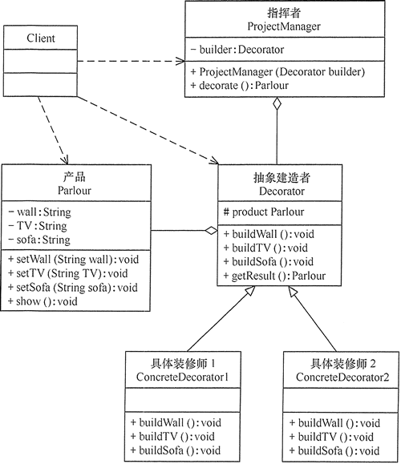

## 模式的定义与特点

建造者（Builder）模式的定义：指将一个复杂对象的构造与它的表示分离，使同样的构建过程可以创建不同的表示，这样的设计模式被称为建造者模式。它是将一个复杂的对象分解为多个简单的对象，然后一步一步构建而成。它将变与不变相分离，即产品的组成部分是不变的，但每一部分是可以灵活选择的。

该模式的主要优点如下：
* 封装性好，构建和表示分离。
* 扩展性好，各个具体的建造者相互独立，有利于系统的解耦。
* 客户端不必知道产品内部组成的细节，建造者可以对创建过程逐步细化，而不对其它模块产生任何影响，便于控制细节风险。

其缺点如下：
* 产品的组成部分必须相同，这限制了其使用范围。
* 如果产品的内部变化复杂，如果产品内部发生变化，则建造者也要同步修改，后期维护成本较大。

建造者（Builder）模式和工厂模式的关注点不同：建造者模式注重零部件的组装过程，而工厂方法模式更注重零部件的创建过程，但两者可以结合使用。

## 模式的结构与实现

### 结构

建造者（Builder）模式的主要角色如下。
1. 产品角色（Product）：它是包含多个组成部件的复杂对象，由具体建造者来创建其各个零部件。
2. 抽象建造者（Builder）：它是一个包含创建产品各个子部件的抽象方法的接口，通常还包含一个返回复杂产品的方法 getResult()。
3. 具体建造者(Concrete Builder）：实现 Builder 接口，完成复杂产品的各个部件的具体创建方法。
4. 指挥者（Director）：它调用建造者对象中的部件构造与装配方法完成复杂对象的创建，在指挥者中不涉及具体产品的信息。


### 实现

（1）产品角色：包含多个组成部件的复杂对象
```java
class Product {
    private String partA;
    private String partB;
    private String partC;
    public void setPartA(String partA) {
        this.partA = partA;
    }
    public void setPartB(String partB) {
        this.partB = partB;
    }
    public void setPartC(String partC) {
        this.partC = partC;
    }
    public void show() {
        //显示产品的特性
    }
}
```

（2）抽象建造者：包含创建产品各个子部件的抽象方法
```java
abstract class Builder {
    //创建产品对象
    protected Product product = new Product();
    public abstract void buildPartA();
    public abstract void buildPartB();
    public abstract void buildPartC();
    //返回产品对象
    public Product getResult() {
        return product;
    }
}
```

（3）具体建造者：实现了抽象建造者接口
```java
public class ConcreteBuilder extends Builder {
    public void buildPartA() {
        product.setPartA("建造 PartA");
    }
    public void buildPartB() {
        product.setPartB("建造 PartB");
    }
    public void buildPartC() {
        product.setPartC("建造 PartC");
    }
}
```

（4）指挥者：调用建造者中的方法完成复杂对象的创建。
```java
class Director {
    private Builder builder;
    public Director(Builder builder) {
        this.builder = builder;
    }
    //产品构建与组装方法
    public Product construct() {
        builder.buildPartA();
        builder.buildPartB();
        builder.buildPartC();
        return builder.getResult();
    }
}
```

（5）客户类
```java
public class Client {
    public static void main(String[] args) {
        Builder builder = new ConcreteBuilder();
        Director director = new Director(builder);
        Product product = director.construct();
        product.show();
    }
}
```

## 应用实例

例子：用建造者模式描述客厅装修

分析：客厅装修是一个复杂的过程，它包含墙体的装修、电视机的选择、沙发的购买与布局等。客户把装修要求告诉项目经理，项目经理指挥装修工人一步步装修，最后完成整个客厅的装修与布局，所以本实例用建造者模式实现比较适合。

这里客厅是产品，包括墙、电视和沙发等组成部分。具体装修工人是具体建造者，他们负责装修与墙、电视和沙发的布局。项目经理是指挥者，他负责指挥装修工人进行装修。



在 _[ParlourDecorator.java](ParlourDecorator.java)_ 中完成该示例

## 应用场景

建造者模式唯一区别于工厂模式的是针对复杂对象的创建。也就是说，如果创建简单对象，通常都是使用工厂模式进行创建，而如果创建复杂对象，就可以考虑使用建造者模式。

当需要创建的产品具备复杂创建过程时，可以抽取出共性创建过程，然后交由具体实现类自定义创建流程，使得同样的创建行为可以生产出不同的产品，分离了创建与表示，使创建产品的灵活性大大增加。

建造者模式主要适用于以下应用场景：
* 相同的方法，不同的执行顺序，产生不同的结果。
* 多个部件或零件，都可以装配到一个对象中，但是产生的结果又不相同。
* 产品类非常复杂，或者产品类中不同的调用顺序产生不同的作用。
* 初始化一个对象特别复杂，参数多，而且很多参数都具有默认值。

## 建造者模式与工厂模式的区别

通过前面的学习，我们已经了解了建造者模式，那么它和工厂模式有什么区别呢？
* 建造者模式更加注重方法的调用顺序，工厂模式注重创建对象。
* 创建对象的力度不同，建造者模式创建复杂的对象，由各种复杂的部件组成，工厂模式创建出来的对象都一样
* 关注重点不一样，工厂模式只需要把对象创建出来就可以了，而建造者模式不仅要创建出对象，还要知道对象由哪些部件组成。
* 建造者模式根据建造过程中的顺序不一样，最终对象部件组成也不一样。