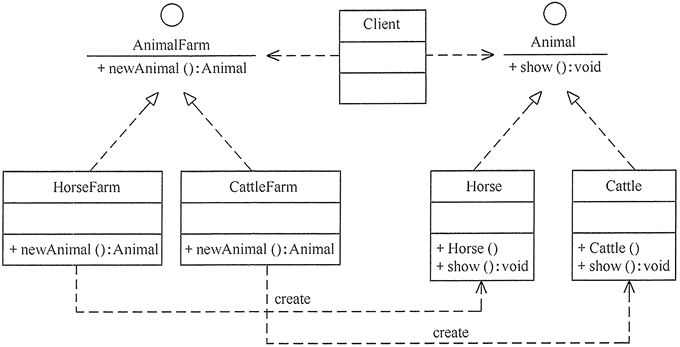
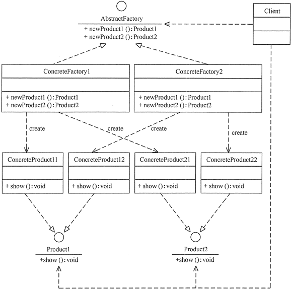
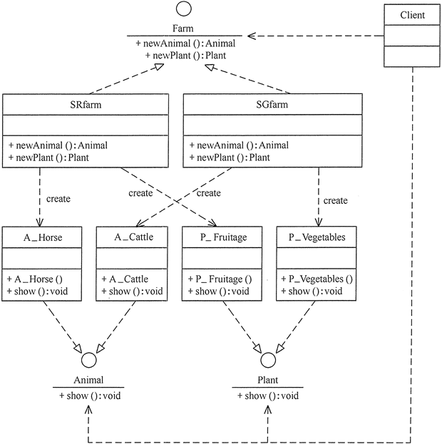

# 工厂模式的定义

定义一个创建产品对象的工厂接口，将产品对象的实际创建工作推迟到具体子工厂类当中。这满足创建型模式中所要求的“创建与使用相分离”的特点。

# 工厂模式的划分
按实际业务场景划分，工厂模式有 3 种不同的实现方式，分别是简单工厂模式、工厂方法模式和抽象工厂模式。

## 简单工厂模式
我们把被创建的对象称为“产品”，把创建产品的对象称为“工厂”。如果要创建的产品不多，只要一个工厂类就可以完成。

在简单工厂模式中创建实例的方法通常为静态（static）方法，因此简单工厂模式（Simple Factory Pattern）又叫作静态工厂方法模式（Static Factory Method Pattern）。

简单来说，简单工厂模式有一个具体的工厂类，可以生成多个不同的产品，属于创建型设计模式。简单工厂模式不在 GoF 23 种设计模式之列。

简单工厂模式每增加一个产品就要增加一个具体产品类和一个对应的具体工厂类，这增加了系统的复杂度，违背了“开闭原则”。

### 模式的结构与实现

简单工厂是简单工厂模式的核心，负责实现创建所有实例的内部逻辑。工厂类的创建产品类可以被外界调用，创建所需的产品对象


```java
public class Client {
    public static void main(String[] args) {
    }
    //抽象产品
    public interface Product {
        void show();
    }
    //具体产品：ProductA
    static class ConcreteProduct1 implements Product {
        public void show() {
            System.out.println("具体产品1显示...");
        }
    }
    //具体产品：ProductB
    static class ConcreteProduct2 implements Product {
        public void show() {
            System.out.println("具体产品2显示...");
        }
    }
    final class Const {
        static final int PRODUCT_A = 0;
        static final int PRODUCT_B = 1;
        static final int PRODUCT_C = 2;
    }
    static class SimpleFactory {
        public static Product makeProduct(int kind) {
            switch (kind) {
                case Const.PRODUCT_A:
                    return new ConcreteProduct1();
                case Const.PRODUCT_B:
                    return new ConcreteProduct2();
            }
            return null;
        }
    }
}
```

## 工厂方法模式

工厂方法模式是对简单工厂模式的进一步抽象化，其好处是可以使系统在不修改原来代码的情况下引进新的产品，即满足开闭原则

### 优缺点

**优点：**
* 用户只需要知道具体工厂的名称就可得到所要的产品，无须知道产品的具体创建过程。
* 灵活性增强，对于新产品的创建，只需多写一个相应的工厂类。
* 典型的解耦框架。高层模块只需要知道产品的抽象类，无须关心其他实现类，满足迪米特法则、依赖倒置原则和里氏替换原则。

**缺点：**
* 类的个数容易过多，增加复杂度
* 增加了系统的抽象性和理解难度
* 抽象产品只能生产一种产品，此弊端可使用抽象工厂模式解决。

### 应用场景
* 客户只知道创建产品的工厂名，而不知道具体的产品名。如 TCL 电视工厂、海信电视工厂等。
* 创建对象的任务由多个具体子工厂中的某一个完成，而抽象工厂只提供创建产品的接口。
* 客户不关心创建产品的细节，只关心产品的品牌

### 模式的结构与实现

工厂方法模式由抽象工厂、具体工厂、抽象产品和具体产品等4个要素构成。

#### 1、模式的结构

工厂方法模式的主要角色如下
1. 抽象工厂（Abstract Factory）：提供了创建产品的接口，调用者通过它访问具体工厂的工厂方法 newProduct() 来创建产品。
2. 具体工厂（ConcreteFactory）：主要是实现抽象工厂中的抽象方法，完成具体产品的创建。
3. 抽象产品（Product）：定义了产品的规范，描述了产品的主要特性和功能。
4. 具体产品（ConcreteProduct）：实现了抽象产品角色所定义的接口，由具体工厂来创建，它同具体工厂之间一一对应。


```java
public class AbstractFactoryTest {
    public static void main(String[] args) {
        try {
            Product a;
            AbstractFactory af;
            af = (AbstractFactory) ReadXML1.getObject();
            a = af.newProduct();
            a.show();
        } catch (Exception e) {
            System.out.println(e.getMessage());
        }
    }
}
//抽象产品：提供了产品的接口
interface Product {
    public void show();
}
//具体产品1：实现抽象产品中的抽象方法
class ConcreteProduct1 implements Product {
    public void show() {
        System.out.println("具体产品1显示...");
    }
}
//具体产品2：实现抽象产品中的抽象方法
class ConcreteProduct2 implements Product {
    public void show() {
        System.out.println("具体产品2显示...");
    }
}
//抽象工厂：提供了厂品的生成方法
interface AbstractFactory {
    public Product newProduct();
}
//具体工厂1：实现了厂品的生成方法
class ConcreteFactory1 implements AbstractFactory {
    public Product newProduct() {
        System.out.println("具体工厂1生成-->具体产品1...");
        return new ConcreteProduct1();
    }
}
//具体工厂2：实现了厂品的生成方法
class ConcreteFactory2 implements AbstractFactory {
    public Product newProduct() {
        System.out.println("具体工厂2生成-->具体产品2...");
        return new ConcreteProduct2();
    }
}
```

### 应用实例
用工厂方法模式设计畜牧场。

分析：有很多种类的畜牧场，如养马场用于养马，养牛场用于养牛，所以该实例用工厂方法模式比较适合。

客户端程序通过对象生成器类 ReadXML2 读取 XML 配置文件中的数据来决定养马还是养牛。其结构图如图



该例子在 _[AnimalFarmTest.java](AnimalFarmTest.java)_ 中实现

## 抽象工厂模式

前面介绍的工厂方法模式中考虑的是一类产品的生产，如畜牧场只养动物、电视机厂只生产电视机、计算机软件学院只培养计算机软件专业的学生等。

同种类称为同等级，也就是说：工厂方法模式只考虑生产同等级的产品，但是在现实生活中许多工厂是综合型的工厂，能生产多等级（种类） 的产品，如农场里既养动物又种植物，电器厂既生产电视机又生产洗衣机或空调，大学既有软件专业又有生物专业等。

### 定义与特点

#### 定义

是一种为访问类提供一个创建一组相关或相互依赖对象的接口，且访问类无须指定所要产品的具体类就能得到同族的不同等级的产品的模式结构。

#### 特点
抽象工厂模式是工厂方法模式的升级版本，工厂方法模式只生产一个等级的产品，而抽象工厂模式可生产多个等级的产品。

使用抽象工厂模式一般要满足以下条件。
系统中有多个产品族，每个具体工厂创建同一族但属于不同等级结构的产品。
系统一次只可能消费其中某一族产品，即同族的产品一起使用。

抽象工厂模式除了具有工厂方法模式的优点外，其他主要优点如下
* 可以在类的内部对产品族中相关联的多等级产品共同管理，而不必专门引入多个新的类来进行管理。
* 当需要产品族时，抽象工厂可以保证客户端始终只使用同一个产品的产品组。
* 抽象工厂增强了程序的可扩展性，当增加一个新的产品族时，不需要修改原代码，满足开闭原则。

其缺点是：当产品族中需要增加一个新的产品时，所有的工厂类都需要进行修改。增加了系统的抽象性和理解难度。

### 模式结构与实现

#### 模式的结构

抽象工厂模式的主要角色如下。
1. 抽象工厂（Abstract Factory）：提供了创建产品的接口，它包含多个创建产品的方法 newProduct()，可以创建多个不同等级的产品。
2. 具体工厂（Concrete Factory）：主要是实现抽象工厂中的多个抽象方法，完成具体产品的创建。
3. 抽象产品（Product）：定义了产品的规范，描述了产品的主要特性和功能，抽象工厂模式有多个抽象产品。
4. 具体产品（ConcreteProduct）：实现了抽象产品角色所定义的接口，由具体工厂来创建，它同具体工厂之间是多对一的关系。



#### 模式的实现

抽象工厂：提供产品的生成方法
    
```java
interface AbstractFactory {
    public Product1 newProduct1();
    public Product2 newProduct2();
}
```

具体工厂：实现产品的生成方法
```java
class ConcreteFactory1 implements AbstractFactory {
    public Product1 newProduct1() {
        System.out.println("具体工厂 1 生成-->具体产品 11...");
        return new ConcreteProduct11();
    }
    public Product2 newProduct2() {
        System.out.println("具体工厂 1 生成-->具体产品 21...");
        return new ConcreteProduct21();
    }
}
```

### 应用实例

用抽象工厂模式设计农场类。

分析：农场中除了像畜牧场一样可以养动物，还可以培养植物，如养马、养牛、种菜、种水果等，所以本实例比前面介绍的畜牧场类复杂，必须用抽象工厂模式来实现。



该示例在 _[FarmTest.java](../abstract_factory/FarmTest.java)_ 中实现

### 抽象工厂模式的应用场景

抽象工厂模式通常适用于以下场景：
1. 当需要创建的对象是一系列相互关联或相互依赖的产品族时，如电器工厂中的电视机、洗衣机、空调等。
2. 系统中有多个产品族，但每次只使用其中的某一族产品。如有人只喜欢穿某一个品牌的衣服和鞋。
3. 系统中提供了产品的类库，且所有产品的接口相同，客户端不依赖产品实例的创建细节和内部结构。

### 抽象工厂模式的扩展

抽象工厂模式的扩展有一定的“开闭原则”倾斜性：
1. 当增加一个新的产品族时只需增加一个新的具体工厂，不需要修改原代码，满足开闭原则。
2. 当产品族中需要增加一个新种类的产品时，则所有的工厂类都需要进行修改，不满足开闭原则。