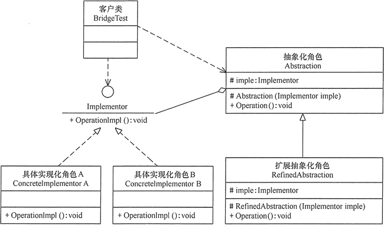
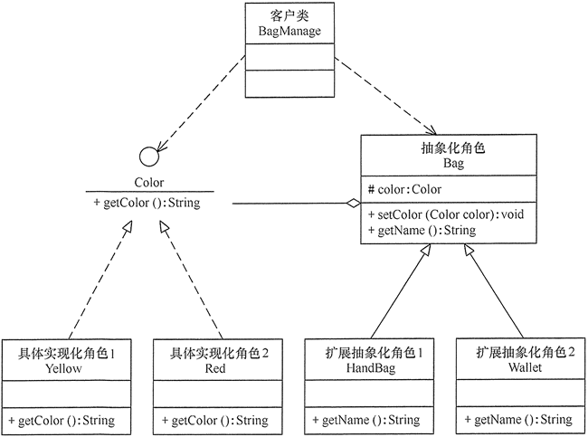
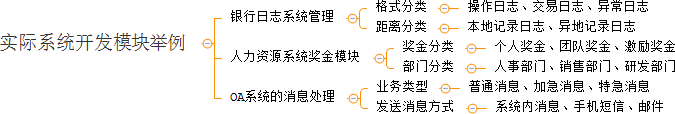

在现实生活中，某些类具有两个或多个维度的变化，如图形既可按形状分，又可按颜色分。如何设计类似于 Photoshop 这样的软件，能画不同形状和不同颜色的图形呢？如果用继承方式，m 种形状和 n 种颜色的图形就有 m×n 种，不但对应的子类很多，而且扩展困难。

当然，这样的例子还有很多，如不同颜色和字体的文字、不同品牌和功率的汽车、不同性别和职业的男女、支持不同平台和不同文件格式的媒体播放器等。如果用桥接模式就能很好地解决这些问题。

## 桥接模式的定义和特点

桥接（Bridge）模式的定义如下：将抽象与实现分离，使它们可以独立变化。它是用组合关系代替继承关系来实现，从而降低了抽象和实现这两个可变维度的耦合度。

通过上面的讲解，我们能很好的感觉到桥接模式遵循了里氏替换原则和依赖倒置原则，最终实现了开闭原则，对修改关闭，对扩展开放。这里将桥接模式的优缺点总结如下。

桥接（Bridge）模式的优点是：
* 抽象与实现分离，扩展能力强
* 符合开闭原则
* 符合合成复用原则
* 其实现细节对客户透明

缺点是：

由于聚合关系建立在抽象层，要求开发者针对抽象化进行设计与编程，能正确地识别出系统中两个独立变化的维度，这增加了系统的理解与设计难度。

## 桥接模式的结构和实现



桥接模式的实现代码如下：

```java
public class BridgeTest {
    public static void main(String[] args) {
        Implementor imple = new ConcreteImplementorA();
        Abstraction abs = new RefinedAbstraction(imple);
        abs.Operation();
    }
}

//实现化角色
interface Implementor {
    public void OperationImpl();
}

//具体实现化角色
class ConcreteImplementorA implements Implementor {
    public void OperationImpl() {
        System.out.println("具体实现化(Concrete Implementor)角色被访问");
    }
}

//抽象化角色
abstract class Abstraction {
    protected Implementor imple;

    protected Abstraction(Implementor imple) {
        this.imple = imple;
    }

    public abstract void Operation();
}

//扩展抽象化角色
class RefinedAbstraction extends Abstraction {
    protected RefinedAbstraction(Implementor imple) {
        super(imple);
    }

    public void Operation() {
        System.out.println("扩展抽象化(Refined Abstraction)角色被访问");
        imple.OperationImpl();
    }
}
```

## 桥接模式的应用实例

用桥接（Bridge）模式模拟女士皮包的选购。

分析：女士皮包有很多种，可以按用途分、按皮质分、按品牌分、按颜色分、按大小分等，存在多个维度的变化，所以采用桥接模式来实现女士皮包的选购比较合适。

本实例按用途分可选钱包（Wallet）和挎包（HandBag），按颜色分可选黄色（Yellow）和红色（Red）。可以按两个维度定义为颜色类和包类。



该示例在 _[BagManage.java](BagManage.java)_ 中实现

## 桥接模式的应用场景

当一个类内部具备两种或多种变化维度时，使用桥接模式可以解耦这些变化的维度，使高层代码架构稳定。

桥接模式通常适用于以下场景。
1. 当一个类存在两个独立变化的维度，且这两个维度都需要进行扩展时。
2. 当一个系统不希望使用继承或因为多层次继承导致系统类的个数急剧增加时。
3. 当一个系统需要在构件的抽象化角色和具体化角色之间增加更多的灵活性时。

桥接模式的一个常见使用场景就是替换继承。我们知道，继承拥有很多优点，比如，抽象、封装、多态等，父类封装共性，子类实现特性。继承可以很好的实现代码复用（封装）的功能，但这也是继承的一大缺点。

